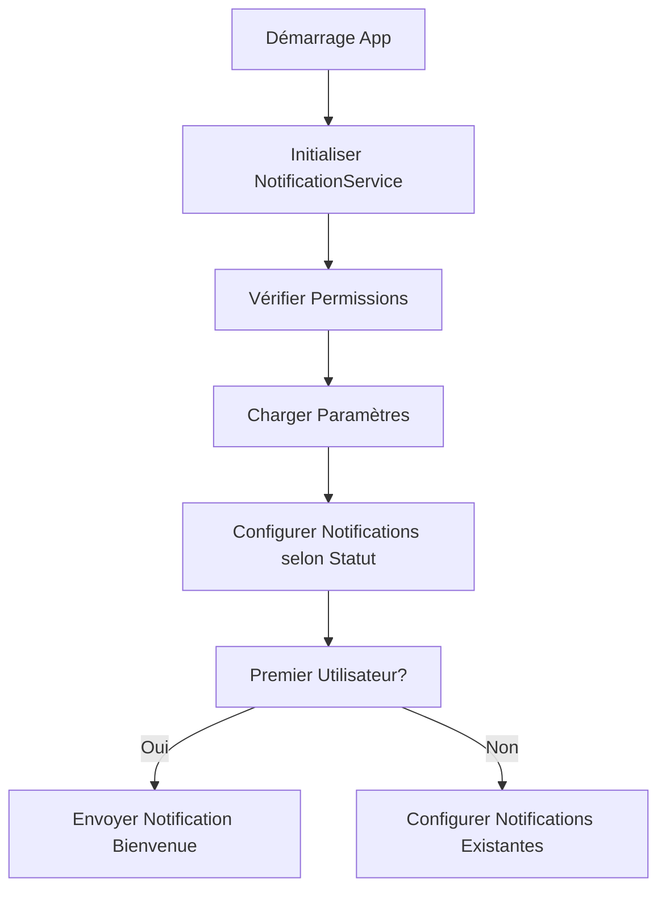
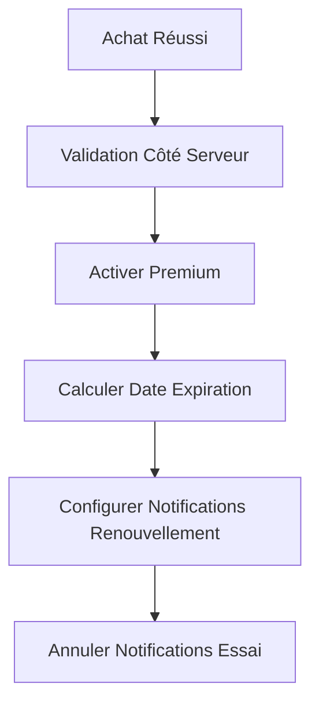
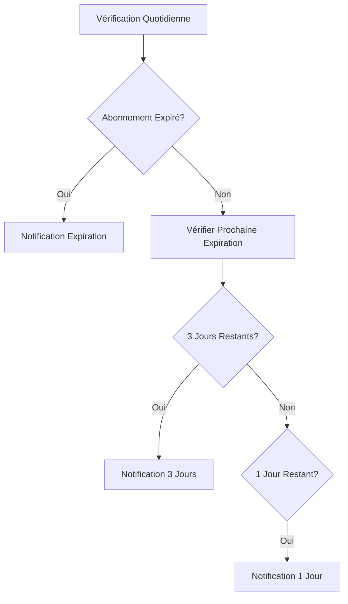

# Système de Notifications de Renouvellement - Smooth AI

## 📋 Vue d'ensemble

Le système de notifications de renouvellement permet d'informer automatiquement les utilisateurs des événements importants liés à leur abonnement et à leur période d'essai.

## 🏗️ Architecture

### Services Implémentés

1. **NotificationService** (`lib/services/notification_service.dart`)
   - Gestion des notifications locales
   - Programmation des notifications
   - Gestion des permissions

2. **Intégration avec les Services Existants**
   - `SubscriptionService`: Notifications d'essai et de renouvellement
   - `InAppPurchaseService`: Notifications post-achat
   - `PremiumProvider`: État des notifications

## 🔔 Types de Notifications

### 1. Notifications de Renouvellement

#### **3 jours avant expiration**
- **Titre:** "Votre abonnement expire bientôt"
- **Message:** "Renouvelez votre abonnement Smooth AI pour continuer à profiter de toutes les fonctionnalités premium."
- **Action:** Redirection vers l'écran premium

#### **1 jour avant expiration**
- **Titre:** "Dernière chance de renouveler"
- **Message:** "Votre abonnement Smooth AI expire demain. Renouvelez maintenant pour éviter toute interruption."
- **Action:** Redirection vers l'écran premium

#### **Jour d'expiration**
- **Titre:** "Votre abonnement a expiré"
- **Message:** "Renouvelez votre abonnement Smooth AI pour retrouver l'accès à toutes les fonctionnalités premium."
- **Action:** Redirection vers l'écran premium

### 2. Notifications d'Essai Gratuit

#### **1 jour avant fin d'essai**
- **Titre:** "Votre essai gratuit se termine demain"
- **Message:** "Abonnez-vous maintenant pour continuer à profiter de toutes les fonctionnalités premium de Smooth AI."
- **Action:** Redirection vers l'écran premium

### 3. Notifications de Bienvenue

#### **Nouvel utilisateur**
- **Titre:** "Bienvenue sur Smooth AI !"
- **Message:** "Découvrez toutes les fonctionnalités premium disponibles pendant votre essai gratuit de 3 jours."
- **Action:** Redirection vers l'écran d'accueil

### 4. Notifications de Fonctionnalités

#### **Nouvelles fonctionnalités**
- **Titre:** "Nouvelle fonctionnalité disponible"
- **Message:** "Découvrez [nom de la fonctionnalité] : [description]"
- **Action:** Redirection vers la fonctionnalité

## ⚙️ Configuration

### Initialisation

```dart
// Dans main.dart
final notificationService = Provider.of<NotificationService>(context, listen: false);
await notificationService.initialize();
```

### Permissions

Le système vérifie automatiquement les permissions de notifications :

```dart
final hasPermission = await notificationService.checkNotificationPermissions();
```

### Paramètres Utilisateur

Les utilisateurs peuvent personnaliser leurs notifications via `NotificationSettingsScreen` :

- **Rappels de renouvellement** : Notifications avant expiration
- **Rappels d'essai gratuit** : Notifications avant fin d'essai
- **Nouvelles fonctionnalités** : Notifications de nouveautés

## 🔄 Flux de Notifications

### 1. Démarrage de l'Application



### 2. Achat Réussi



### 3. Expiration d'Abonnement



## 📱 Interface Utilisateur

### Écran de Paramètres

`NotificationSettingsScreen` permet aux utilisateurs de :

1. **Voir le statut des permissions**
   - Indicateur visuel (vert/orange)
   - Bouton d'activation si nécessaire

2. **Gérer les types de notifications**
   - Switches pour chaque type
   - Descriptions claires

3. **Informations sur les notifications**
   - Explication du système
   - Bonnes pratiques

### Intégration dans l'App

```dart
// Navigation vers les paramètres
Navigator.push(
  context,
  MaterialPageRoute(
    builder: (context) => const NotificationSettingsScreen(),
  ),
);
```

## 🔧 Personnalisation

### Ajouter un Nouveau Type de Notification

1. **Définir l'ID**
   ```dart
   static const int _newNotificationId = 6;
   ```

2. **Ajouter la méthode**
   ```dart
   Future<void> sendNewNotification(String title, String body) async {
     await _showNotification(
       id: _newNotificationId,
       title: title,
       body: body,
       payload: 'new_notification',
     );
   }
   ```

3. **Gérer le tap**
   ```dart
   case 'new_notification':
     // Navigation vers l'écran approprié
     break;
   ```

### Personnaliser les Messages

```dart
// Messages personnalisés selon le contexte
final message = isPremium 
    ? 'Renouvelez votre abonnement premium'
    : 'Passez à premium pour débloquer toutes les fonctionnalités';
```

## 🧪 Tests

### Tests Unitaires

```dart
test('should schedule renewal notification', () async {
  final service = NotificationService();
  await service.initialize();
  
  final expiryDate = DateTime.now().add(const Duration(days: 30));
  await service.setupRenewalNotifications(expiryDate);
  
  // Vérifier que les notifications sont programmées
});
```

### Tests d'Intégration

```dart
testWidgets('should show notification settings', (tester) async {
  await tester.pumpWidget(
    MaterialApp(
      home: NotificationSettingsScreen(),
    ),
  );
  
  expect(find.text('Notifications'), findsOneWidget);
  expect(find.text('Types de Notifications'), findsOneWidget);
});
```

## 🐛 Dépannage

### Problèmes Communs

1. **Notifications ne s'affichent pas**
   - Vérifier les permissions
   - Vérifier que l'app n'est pas en mode "Ne pas déranger"
   - Vérifier les paramètres système

2. **Notifications programmées manquantes**
   - Vérifier que l'app n'a pas été tuée
   - Vérifier les paramètres de batterie
   - Vérifier les logs de debug

3. **Permissions refusées**
   - Guider l'utilisateur vers les paramètres
   - Expliquer l'importance des notifications
   - Proposer une alternative (email, etc.)

### Logs de Debug

```dart
// Activer les logs détaillés
debugPrint('Notification programmée pour le ${scheduledDate.toString()}');
debugPrint('Permission accordée: $_hasPermission');
debugPrint('Paramètres chargés: $_notificationSettings');
```

## 📊 Analytics

### Métriques à Suivre

1. **Taux d'ouverture des notifications**
   - Notifications de renouvellement
   - Notifications d'essai
   - Notifications de bienvenue

2. **Conversions**
   - Essai → Abonnement après notification
   - Renouvellement après rappel

3. **Engagement**
   - Temps passé dans l'app après notification
   - Actions effectuées après notification

### Intégration Analytics

```dart
// Exemple avec Firebase Analytics
await FirebaseAnalytics.instance.logEvent(
  name: 'notification_opened',
  parameters: {
    'notification_type': 'renewal_reminder',
    'user_type': isPremium ? 'premium' : 'trial',
  },
);
```

## 🔒 Sécurité et Confidentialité

### Bonnes Pratiques

1. **Respecter les préférences utilisateur**
   - Ne pas envoyer de notifications non désirées
   - Permettre la désactivation facile

2. **Protéger les données personnelles**
   - Ne pas inclure d'informations sensibles
   - Utiliser des messages génériques

3. **Respecter les réglementations**
   - GDPR pour l'UE
   - CCPA pour la Californie
   - Autres réglementations locales

### Politique de Confidentialité

Inclure dans votre politique de confidentialité :

```
Nous utilisons des notifications push pour :
- Vous informer de l'expiration de votre abonnement
- Vous rappeler la fin de votre essai gratuit
- Vous informer des nouvelles fonctionnalités

Vous pouvez désactiver ces notifications à tout moment dans les paramètres de l'application.
```

## 🔄 Maintenance

### Mises à Jour Régulières

1. **Vérifier les permissions**
   - Système d'exploitation mis à jour
   - Nouvelles restrictions

2. **Optimiser les messages**
   - A/B testing des messages
   - Amélioration des taux de conversion

3. **Ajouter de nouveaux types**
   - Fonctionnalités demandées
   - Amélioration de l'expérience utilisateur

### Monitoring

- Surveiller les taux d'erreur
- Analyser les retours utilisateurs
- Optimiser les performances

## 📞 Support

### Documentation Utilisateur

Créer une FAQ pour les utilisateurs :

**Q: Comment désactiver les notifications ?**
R: Allez dans Paramètres > Notifications et désactivez les types souhaités.

**Q: Pourquoi ne reçois-je pas de notifications ?**
R: Vérifiez que les notifications sont activées dans les paramètres de votre appareil.

**Q: Puis-je personnaliser les notifications ?**
R: Oui, vous pouvez choisir quels types de notifications recevoir dans les paramètres de l'app.

### Support Technique

Pour les développeurs :
- Documentation du code
- Exemples d'utilisation
- Guide de dépannage 